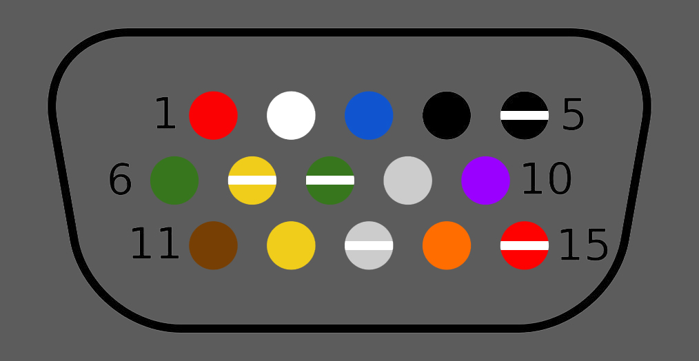

Interface
=========

The control console and the amplifier are connected by a cable that uses a
`DE-15 <https://en.wikipedia.org/wiki/D-subminiature>`_ connector. This can be
extended with a `VGA <https://en.wikipedia.org/wiki/VGA_connector>`_ extension
cable (but the screws to hold the connectors together will be mismatched).

Pin out
-------

+-----+---------------+-------------------------------------------+-------------------------+
| Pin | Wire Color    | Console                                   | Amplifier               |
+=====+===============+===========================================+=========================+
|   1 |  Red          | 100kΩ to ground when disconnected         | Headphones Right        |
+-----+---------------+-------------------------------------------+-------------------------+
|   2 |  White        | 100kΩ to ground when disconnected         | Headphones Left         |
+-----+---------------+-------------------------------------------+-------------------------+
|   3 |  Blue         | Unknown (Aux ground?)                     |                         |
+-----+---------------+-------------------------------------------+-------------------------+
|   4 |  Black        | Aux Right                                 |                         |
+-----+---------------+-------------------------------------------+-------------------------+
|   5 |  Black/White  | Aux Left                                  |                         |
+-----+---------------+-------------------------------------------+-------------------------+
|   6 |  Green        | Ground                                    | Ground                  |
+-----+---------------+-------------------------------------------+-------------------------+
|   7 |  Yellow/White | Unused                                    | Unused                  |
+-----+---------------+-------------------------------------------+-------------------------+
|   8 |  Green/White  | Amplifier presence                        | Unknown signalling      |
+-----+---------------+-------------------------------------------+-------------------------+
|   9 |  Gray         | Unused                                    | Unused                  |
+-----+---------------+-------------------------------------------+-------------------------+
|  10 |  Purple       | Unused                                    | Unused                  |
+-----+---------------+-------------------------------------------+-------------------------+
|  11 |  Brown        | Power supply                              | 3.3V                    |
+-----+---------------+-------------------------------------------+-------------------------+
|  12 |  Yellow       | Rx                                        | Tx                      |
+-----+---------------+-------------------------------------------+-------------------------+
|  13 |  Gray/White   | Tx                                        | Rx                      |
+-----+---------------+-------------------------------------------+-------------------------+
|  14 |  Orange       | Unused                                    | Unused                  |
+-----+---------------+-------------------------------------------+-------------------------+
|  15 |  Red/White    | 0V if present                             | Console presence        |
+-----+---------------+-------------------------------------------+-------------------------+

*Image reference of the port, showing which wire color is what on the original console cable.*
**NOTE! This is from the sub/amp side, not the numbers on the cable!** *(yes the connector on the cable is labeled with numbers)*

Serial communication
--------------------

The Rx/Tx pins are 3.3V TTL serial at a baud rate of 57600 bps with 8 bits per
byte, odd parity and 1 stop bit. All communication is initiated by the console.

The amplifier will turn off the speakers if there is no console present.

The console will get upset if the amplifier is not present (this is the cause of
the 2, 3 or 4 error LEDs displayed).

The `protocol <protocol.rst>`_ is a simple binary interface.
